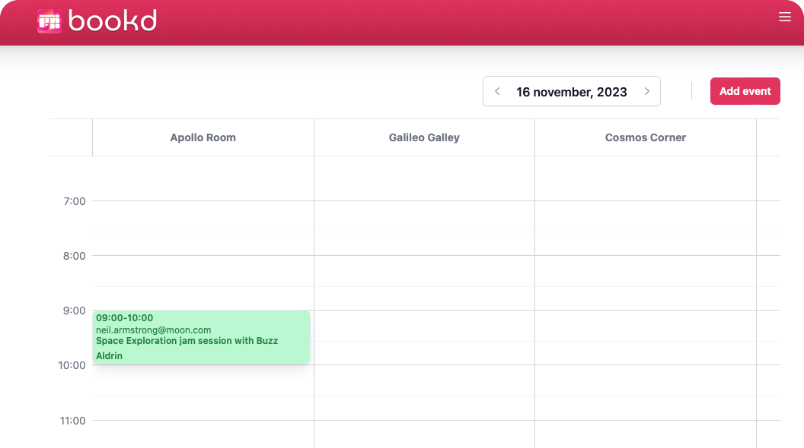

# bookd




## Access bookd Online

For those who prefer to jump straight into using bookd without the need to set it up locally, you're in luck! bookd is accessible online for free at [bookd.xyz](https://bookd.xyz).

### Features Available Online:

- **Instant Access**: No installation or setup required. Get straight to booking your resources and rooms.
- **Full Functionality**: Enjoy all the features of bookd just as you would locally.
- **Secure and Up-to-date**: Always access the latest version with all the newest features and security updates.

Whether you're planning your next team meeting or booking resources for a project, bookd makes it simple and efficient. Try it out now and take the hassle out of resource booking!

## Overview

bookd is a free, open-source room booking application designed to simplify the process of reserving conference rooms and resources for teams and businesses. With bookd, users can effortlessly add new facilities, manage bookings, and schedule tasks, ensuring efficient use of resources and spaces.

## Getting Started

To get bookd running locally on your machine, follow the steps below:

1. **Install Wasp**: First, you'll need to have Wasp installed. Execute the following command in your terminal:

```shell
curl -sSL https://get.wasp-lang.dev/installer.sh | sh
```

2. **Environment Configuration**: Create a `.env.server` file in the root directory of your project.

3. **Configure API Keys**: Copy the contents of the `env.server.example` file into `.env.server`. Fill in the necessary API keys and configurations.

4. **Database Setup**: Ensure you have a Database connected. You can:
    - Use Docker to start a Postgres database by running `wasp start db` in the project root. Make sure Docker is installed on your machine.
    - Alternatively, set up a Postgres database on [Railway](https://railway.app), copy the connection URL from settings, and paste it into your `.env.server` file as `DATABASE_URL=<your-postgres-connection-url>`.

5. **Database Migration**: Run the following command to migrate your database:

```shell
wasp db migrate-dev
```

6. **Start the Application**: Launch bookd by executing:

```shell
wasp start
```

7. **Access bookd**: Open your web browser and navigate to `localhost:3000`. Your NodeJS server will be operational on port `3001`.

8. **Enhance Your Developer Experience**: For an optimal development experience, install the [Wasp extension for VSCode](https://marketplace.visualstudio.com/items?itemName=wasp-lang.wasp).

## Features

- **Custom Rooms and Resources**: Easily add and manage multiple facilities, rooms, and resources.
- **Collaboration**: Control access to bookings and resources by creating members for facilities.
- **Task Scheduling**: Supports both recurring and one-time bookings with ease.
- **Security and Reliability**: Ensures secure and reliable access to your bookings and resources.

## Contributing

bookd is open for contributions! Whether it's adding new features, fixing bugs, or improving documentation, we welcome your pull requests and issues on GitHub.

## License

bookd is released under the MIT License. See the [LICENSE](LICENSE) file for more details.

---

This README is designed to give a clear overview of your project and how to get it running locally. Adjust the paths, URLs, and specific steps as necessary for your project's structure and requirements.